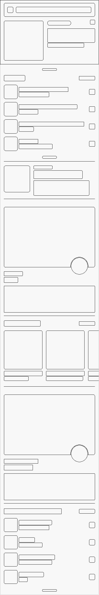

# rw-app-design-prasad

Practical part of the "App Design" book.

## Chapter 1. Book Overview & App Preview

Key points:

- Create Figma account to be able to create workspace;
- Drag .fig file into Figma app interface to import design;
- Use *Design* panel, shapes (oval and lines), alignment and grouping to create a simple close button;
- Use *Prototype* panel to add an interaction to navigate back and forth between frames (screens);
- Deploy interactive prototypes to a physical device via Figma Mirror mobile app.

## Chapter 2. Workspace Tour & Figma Fundamentals

Key points:

- Fill a shape with linear gradient using **Fill › (Click +) › Linear** with configured handles colors and its positions;
- Built-in frames allows you to create frames of predefined sizes (e.g. iPhone SE, iPad mini, etc.);
- Use shape tools and its properties to create and style basic shapes;
- Use Option+WASD hotkeys to align selected shape to top, left, bottom and right respectively;
- Use Auto Layout to create adaptive UI elements;
- Use Constraints to create responsive UI that adapts to frame size changes.

## Chapter 3. App Teardowns

Key points:
- Tering down apps designs is extremely important skill;
- Any layout is consists of repeatable components;
- Boolean operations (unioning, subtraction, intersection, excluding) are helpful when you need a shape as a combination of other shapes.
